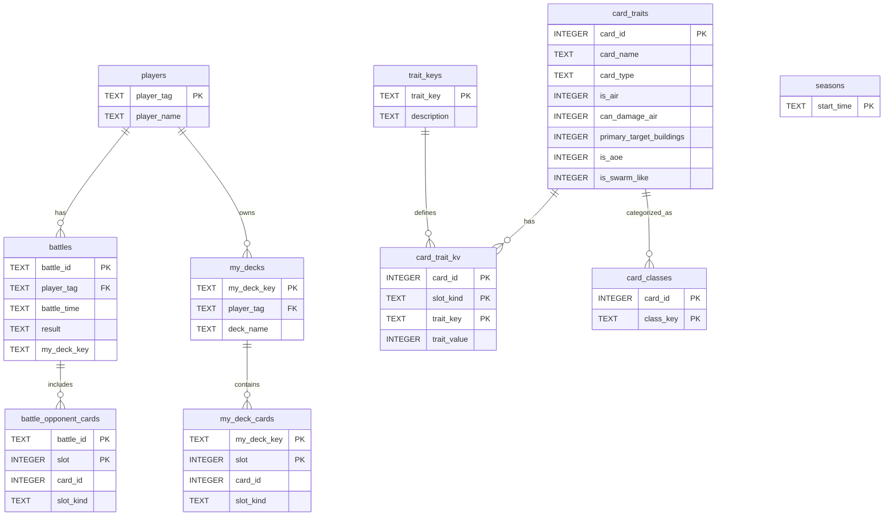

# CR_ledger ER Diagram

```mermaid
erDiagram
  players {
    TEXT player_tag PK
    TEXT player_name
  }

  battles {
    TEXT battle_id PK
    TEXT player_tag FK
    TEXT battle_time
    TEXT result
    TEXT my_deck_key
  }

  battle_opponent_cards {
    TEXT battle_id PK
    INTEGER slot PK
    INTEGER card_id
    TEXT slot_kind
  }

  my_decks {
    TEXT my_deck_key PK
    TEXT player_tag FK
    TEXT deck_name
  }

  my_deck_cards {
    TEXT my_deck_key PK
    INTEGER slot PK
    INTEGER card_id
    TEXT slot_kind
  }

  card_traits {
    INTEGER card_id PK
    TEXT card_name
    TEXT card_type
    INTEGER is_air
    INTEGER can_damage_air
    INTEGER primary_target_buildings
    INTEGER is_aoe
    INTEGER is_swarm_like
  }

  trait_keys {
    TEXT trait_key PK
    TEXT description
  }

  card_trait_kv {
    INTEGER card_id PK
    TEXT slot_kind PK
    TEXT trait_key PK
    INTEGER trait_value
  }

  card_classes {
    INTEGER card_id PK
    TEXT class_key PK
  }

  seasons {
    TEXT start_time PK
  }

  players ||--o{ battles : has
  players ||--o{ my_decks : owns
  battles ||--o{ battle_opponent_cards : includes
  my_decks ||--o{ my_deck_cards : contains
  card_traits ||--o{ card_trait_kv : has
  trait_keys ||--o{ card_trait_kv : defines
  card_traits ||--o{ card_classes : categorized_as
```